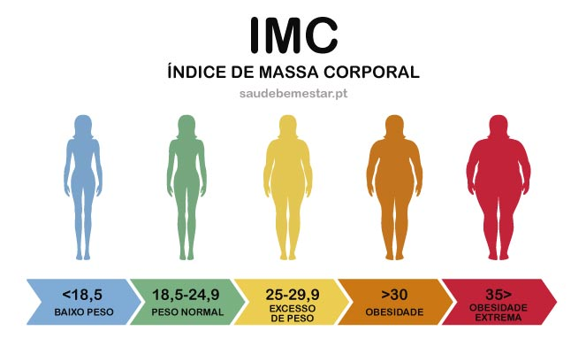

```{r}
#| label: setup
#| include: false

library(tidyverse)
library(readxl)
library(janitor)
library(corrplot)
library(rstatix)
library(knitr)
library(kableExtra)
library(forcats)
library(broom)

theme_set(
  theme_minimal(base_size = 18)
)

base <- read_excel("Nutricao.xlsx") |>
  clean_names()

base <- base |>
  mutate(
    genero = as.factor(genero),
    regiao = as.factor(regiao),
    covid = as.factor(covid),
    delivery = as.factor(delivery),
    atividade_fisica_pandemia =
      as.factor(atividade_fisica_pandemia)
  )
```

# **SUMÁRIO**

1. Contextualização

2. Base de Dados

3. Estatística Descritiva

4. Análises Inferenciais

5. Correlação

6. Conclusões

# **1. Contextualização**

## **Pandemia, objetivos e hipóteses**

A pandemia da COVID-19 provocou mudanças relevantes:

- hábitos alimentares;
- prática de atividade física;
- comportamento social;
- padrões de consumo.

Objetivos da análise:

- investigar relações entre IMC e atividade física;
- avaliar associação entre COVID e delivery;
- analisar correlações entre variáveis antropométricas.

Hipóteses investigadas:

- diferenças de IMC entre grupos;
- associação entre delivery e COVID;
- correlação linear entre variáveis corporais.

# **2. Base de Dados**

## **Características gerais**

```{r}
#| echo: false

resumo_base <- tibble(
  Característica = c(
    "Observações",
    "Variáveis",
    "Quantitativas",
    "Qualitativas"
  ),
  Valor = c(
    nrow(base),
    ncol(base),
    sum(sapply(base, is.numeric)),
    sum(
      sapply(
        base,
        function(x)
          is.factor(x) || is.character(x)
      )
    )
  )
)

kable(
  resumo_base,
  align = "c"
) |>
  kable_styling(
    full_width = FALSE,
    font_size = 18
  )
```

Variáveis quantitativas:

- idade;
- altura;
- peso;
- IMC.

Variáveis qualitativas:

- gênero;
- região;
- COVID;
- delivery;
- atividade física.

---

## **Distribuição regional**

```{r}
#| echo: false

base |>
  count(regiao) |>
  ggplot(
    aes(
      fct_reorder(regiao, n),
      n
    )
  ) +
  geom_col() +
  coord_flip() +
  labs(
    x = "Região",
    y = "Quantidade",
    title = "Distribuição regional"
  )
```

# **3. Estatística Descritiva**

## **Resumo estatístico do IMC**

```{r}
#| echo: false

base |>
  summarise(
    Média = mean(imc, na.rm = TRUE),
    Mediana = median(imc, na.rm = TRUE),
    `Desvio Padrão` = sd(imc, na.rm = TRUE),
    Mínimo = min(imc, na.rm = TRUE),
    Máximo = max(imc, na.rm = TRUE)
  ) |>
  mutate(
    across(where(is.numeric), round, 2)
  ) |>
  kable(
    align = "c"
  ) |>
  kable_styling(
    full_width = FALSE,
    font_size = 18
  )
```

{width=70% fig-align="center"}

---

## **Distribuição do IMC**

```{r}
#| echo: false

base |>
  ggplot(aes(imc)) +
  geom_histogram(
    bins = 30
  ) +
  labs(
    x = "IMC",
    y = "Frequência",
    title = "Distribuição do IMC"
  )
```

Interpretação:

- presença de dispersão moderada;
- possíveis outliers;
- leve assimetria;
- indícios de não normalidade.

---

## **QQ-Plot do IMC**

```{r}
#| echo: false

base |>
  ggplot(aes(sample = imc)) +
  stat_qq() +
  stat_qq_line() +
  labs(
    title = "QQ-Plot do IMC"
  )
```

Interpretação:

- desvios da reta indicam não aderência à normalidade;
- presença de assimetria ou caudas discrepantes.

---

## **IMC segundo gênero**

```{r}
#| echo: false

base |>
  ggplot(aes(genero, imc)) +
  geom_boxplot() +
  labs(
    x = "Gênero",
    y = "IMC",
    title = "IMC por gênero"
  )
```

---

## **Distribuição etária**

```{r}
#| echo: false

base |>
  ggplot(aes(idade)) +
  geom_histogram(
    bins = 25
  ) +
  labs(
    x = "Idade",
    y = "Frequência",
    title = "Distribuição das idades"
  )
```

---

## **Mudança no delivery**

```{r}
#| echo: false

base |>
  count(delivery) |>
  ggplot(aes(delivery, n)) +
  geom_col() +
  labs(
    x = "Categoria",
    y = "Quantidade",
    title = "Mudança no delivery"
  )
```

# **4. Análises Inferenciais**

## **Teste de Shapiro-Wilk**

Hipóteses:

$$
H_0:\text{ normalidade}
$$

$$
H_1:\text{ não normalidade}
$$

```{r}
#| echo: false

set.seed(123)

dados_shapiro <- base$imc |>
  na.omit()

if(length(dados_shapiro) > 500){
  dados_shapiro <- sample(
    dados_shapiro,
    500
  )
}

shapiro_result <- shapiro.test(
  dados_shapiro
)

resultado_shapiro <- tibble(
  Estatística =
    round(
      shapiro_result$statistic,
      4
    ),
  `p-valor` =
    round(
      shapiro_result$p.value,
      6
    )
)

kable(
  resultado_shapiro,
  align = "c"
) |>
  kable_styling(
    full_width = FALSE,
    font_size = 18
  )
```

Conclusão:

- rejeição da hipótese de normalidade;
- distribuição não aderente ao modelo normal;
- necessidade de cautela com métodos paramétricos.

---

## **Teste de Levene**

Hipóteses:

$$
H_0:\sigma_1^2=\sigma_2^2=\cdots=\sigma_k^2
$$

$$
H_1:\text{ variâncias diferentes}
$$

```{r}
#| echo: false

levene <- levene_test(
  base,
  imc ~ atividade_fisica_pandemia
)

kable(
  levene,
  align = "c"
) |>
  kable_styling(
    full_width = FALSE,
    font_size = 18
  )
```

Conclusão:

- se \(p < 0.05\), há heterocedasticidade;
- ANOVA clássica pode não ser adequada.

---

## **ANOVA de Welch**

Como houve indícios de heterocedasticidade, optou-se pela ANOVA de Welch, que é robusta à violação da homogeneidade das variâncias.

Hipóteses:

$$
H_0:\mu_1=\mu_2=\cdots=\mu_k
$$

$$
H_1:\text{ pelo menos uma média difere}
$$

```{r}
#| echo: false

welch <- oneway.test(
  imc ~ atividade_fisica_pandemia,
  data = base,
  var.equal = FALSE
)

resultado_welch <- tibble(
  Estatística =
    round(welch$statistic, 4),
  `p-valor` =
    round(welch$p.value, 6)
)

kable(
  resultado_welch,
  align = "c"
) |>
  kable_styling(
    full_width = FALSE,
    font_size = 18
  )
```

Conclusão:

- diferenças significativas indicam associação entre IMC e atividade física.

---

## **IMC e atividade física**

```{r}
#| echo: false

base |>
  ggplot(
    aes(
      atividade_fisica_pandemia,
      imc
    )
  ) +
  geom_boxplot() +
  coord_flip() +
  labs(
    x = "Atividade física",
    y = "IMC",
    title = "IMC e atividade física"
  )
```

---

## **Teste Qui-Quadrado**

O teste Qui-Quadrado avalia associação entre variáveis qualitativas.

Hipóteses:

$$
H_0:\text{ independência}
$$

$$
H_1:\text{ associação}
$$

```{r}
#| echo: false

cont_tab <- table(
  base$covid,
  base$delivery
)

qui <- chisq.test(cont_tab)

resultado_qui <- tibble(
  Estatística =
    round(qui$statistic, 3),
  `p-valor` =
    round(qui$p.value, 6)
)

kable(
  resultado_qui,
  align = "c"
) |>
  kable_styling(
    full_width = FALSE,
    font_size = 18
  )
```

Conclusão:

- associação sugere impacto da pandemia sobre o delivery.

---

## **Mapa de associação**

```{r}
#| echo: false

prop.table(cont_tab, 1) |>
  as.data.frame() |>
  ggplot(
    aes(
      Var2,
      Var1,
      fill = Freq
    )
  ) +
  geom_tile() +
  geom_text(
    aes(
      label = round(Freq, 2)
    ),
    size = 6
  ) +
  labs(
    x = "Delivery",
    y = "COVID",
    title = "Proporções condicionais"
  )
```

# **5. Correlação**

## **Correlação linear de Pearson**

O coeficiente de Pearson mede intensidade e direção da associação linear.

Hipóteses:

$$
H_0:\rho=0
$$

$$
H_1:\rho\neq0
$$

---

## **Matriz de correlação**

```{r}
#| echo: false

dados_num <- base |>
  select(where(is.numeric))

cor_mat <- cor(
  dados_num,
  use = "pairwise.complete.obs"
)

corrplot(
  cor_mat,
  method = "color",
  addCoef.col = "black"
)
```

Interpretação:

- valores próximos de +1 indicam associação positiva;
- valores próximos de -1 indicam associação negativa;
- valores próximos de 0 indicam baixa relação linear.

---

## **Peso versus IMC**

```{r}
#| echo: false

base |>
  ggplot(aes(peso, imc)) +
  geom_point(alpha = 0.4) +
  geom_smooth(
    method = "lm",
    se = FALSE
  ) +
  labs(
    x = "Peso",
    y = "IMC",
    title = "Peso versus IMC"
  )
```

---

## **Síntese das correlações**

A análise indicou:

- forte associação entre peso e IMC;
- associação moderada entre altura e peso;
- baixa relação entre idade e variáveis corporais.

# **6. Conclusões**

## **Principais resultados**

A análise evidenciou:

- alterações comportamentais durante a pandemia;
- associação entre IMC e atividade física;
- relação entre COVID e delivery;
- forte correlação entre variáveis antropométricas.

---

## **Considerações finais**

A utilização de métodos descritivos e inferenciais permitiu:

- caracterização da amostra;
- comparação entre grupos;
- investigação de associações;
- interpretação quantitativa dos dados.

Limitações:

- dados autorreportados;
- possíveis vieses amostrais;
- ausência de acompanhamento longitudinal.

# **Referências**

Agresti, A. (2019)  
*An Introduction to Categorical Data Analysis.*

James, G. et al. (2021)  
*An Introduction to Statistical Learning.*

Johnson, R. A., & Wichern, D. W. (2007)  
*Applied Multivariate Statistical Analysis.*

Montgomery, D. C. (2019)  
*Design and Analysis of Experiments.*

# **FIM**